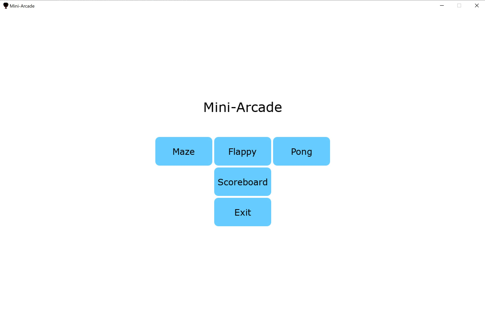
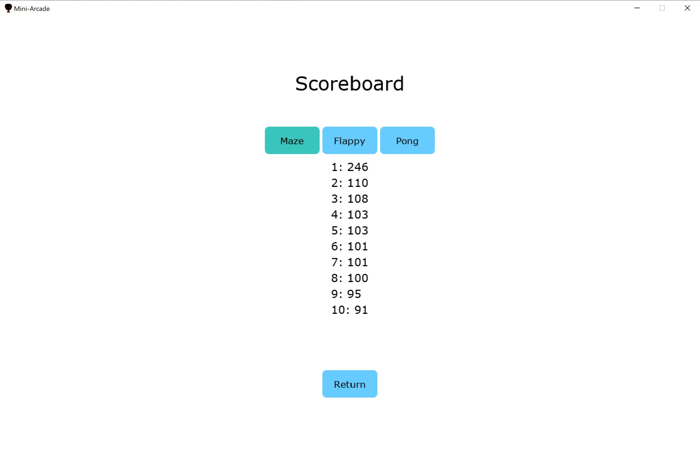
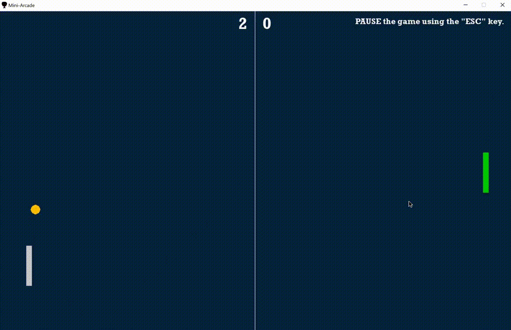
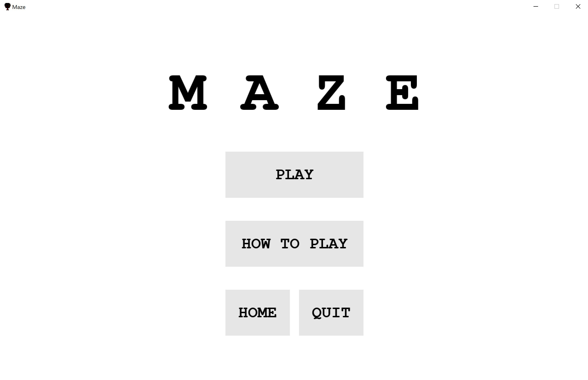
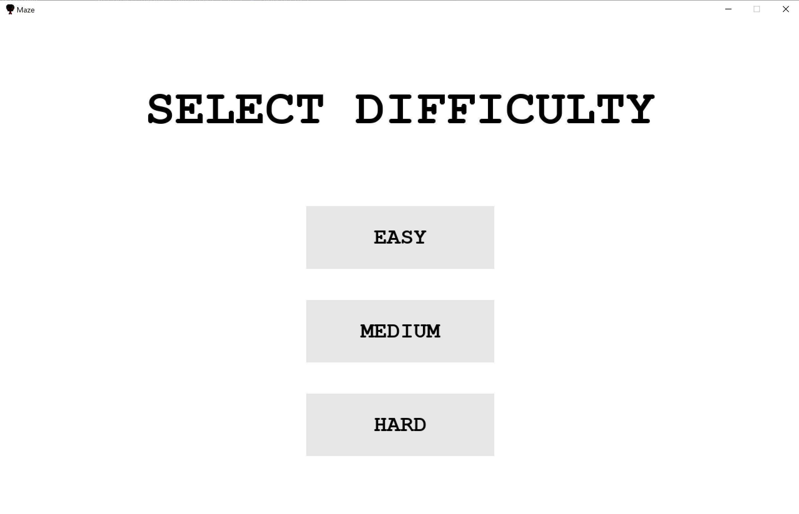
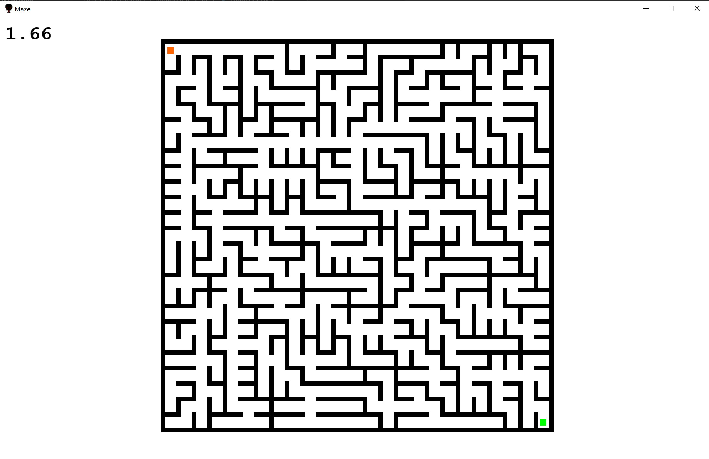
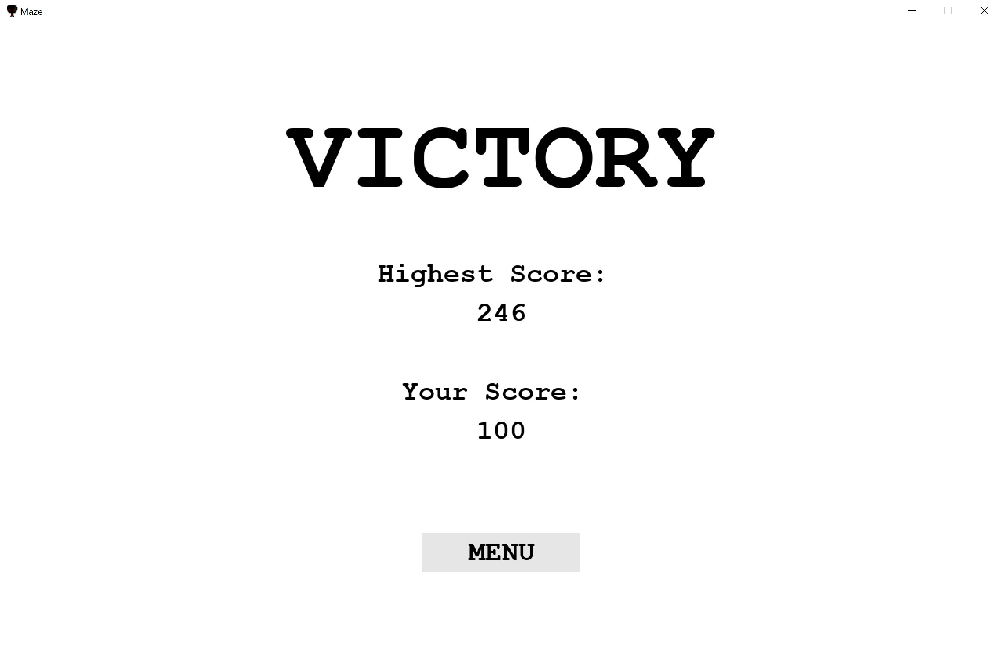
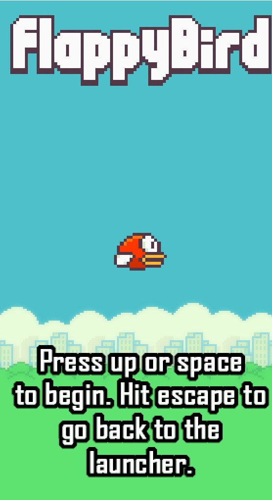

# MiniArcade

Group project for SFWRENG 3XA3 in the Winter 2020 session.
Team Members and Responsibilities:

    Arshan Khan | Pong  
    Andrew Hum | Maze 
    William Lei | Scoreboard  
    Jame Tran | Flappy

This project is a reimplementation of several simple python games. Along with the redesign of these games we are designing a launcher for these minigames to select which game the user would like to play. The arrow keys are used for the main game controls; extra game controls (if any) are specified in each game.

Any future updates or work by **Arshan Khan** will be recorded here.

### Launcher Screenshots

- Mini Arcade Launcher home page

  

- Scoreboard page

    

### Pong Gameplay

- Pong - Sample gameplay
- A full video of the gameplay is available at https://youtu.be/xLBJqTBa2bA

    

### Maze Screenshots

- Maze - Main Menu

  

- Maze - Difficulty selection

  

- Maze - Game screen

  

- Maze - End game screen

    

### Flappy Screenshots

- Flappy game screen

  
